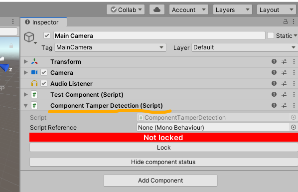
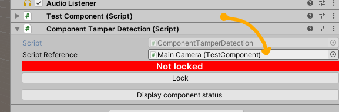
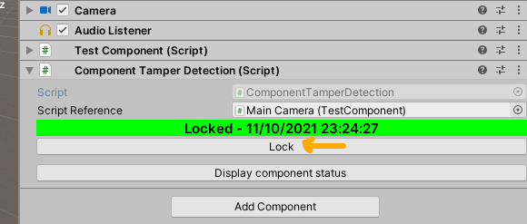
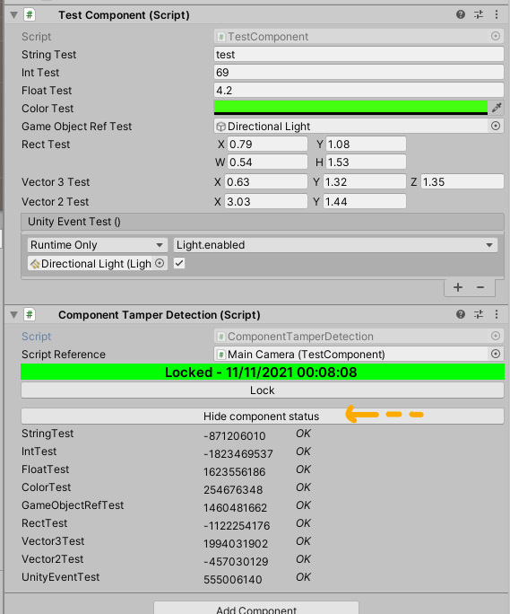
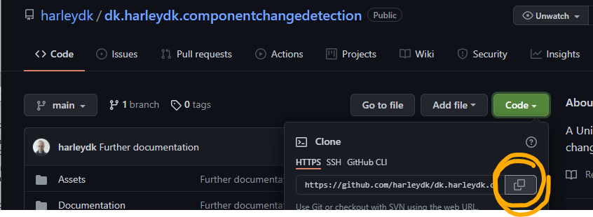
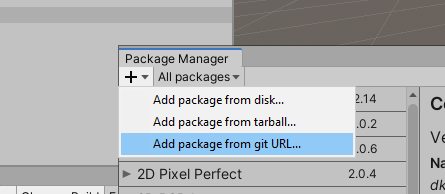
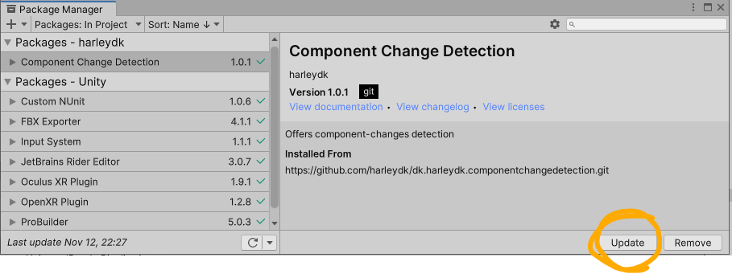
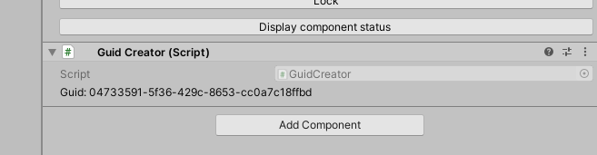
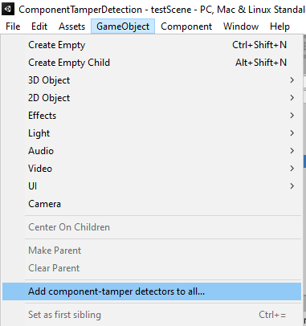
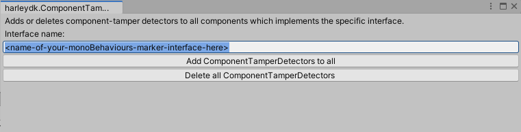

# ComponentTamperDetection
A Unity3d package for component-changes detection

## Wishful thinking

Do you ever wish you could see what's changed in a MonoBehaviour that should not change, ever? Or did it ever happen that your game stopped working because a MonoBehaviour-reference is suddenly 'None' where it should reference another component? Or some other value, that you thought you could count on, is different? Because that never happens, right?

If so, then ComponentTamperDetection is for you.

It will make it possible to 'lock' a MonoBehaviour's values in time, and offer visual clue if any of the values change. 

Simply add the component, ...



... drag and drop a MonoBehaviour into the 'Script Reference' field, ...



... and when you're done developing whatever you're working on, press that 'Lock'-button:



The value from the referenced MonoBehaviour are stored into the ComponentTamperDetection component, from where we compare them with later changes. In which case the big red 'Not locked' button displaces the green-is-good 'Locked' one. A decent visual clue - but we can also do automatic unit-testing based on this; more on this later.

This is one for the single dev, or small team, who develops a game and tests it manually and maybe in lots of unit-testing too, and want to 'lock it down' somehow before distributing it; so we can know, visually and also in automated testing (more on that below) that those MonoBehaviours and their values that we've carefully set, that is at the heart of our gameplay, won't change without us being in the know about it. 

Let's face it, we've all developed a feature and it's in version control, and we're thinking we're safe and sound - but  _still_ some value gets changed that shouldn't have, and without some kind of test - visual or automatic - it can be a cruel time-waste, hunting for that change. This component offers both a visual and automatic change-detection. A disclaimer: this is not a 'lock down' of a MonoBehaviour in the literal sense. You will still be able to - as you should - change the values of a MonoBehaviour you've 'locked' - but you can be sure the component will let you know about it. 

_It is a tool that's meant to make you sleep better at night. It will arm you with the knowledge that something you thought was set in stone isn't so anymore, and give you a chance to react before it slips out into production._


## What's in the box?

The component works by traversing the public fields and storing a [hash-code](https://docs.microsoft.com/en-us/dotnet/api/system.object.gethashcode?view=net-5.0) of their value. Although not guarenteed to be unique, they'll do fine for this use-case.

The 'Display/Hide component status'-button offers a peak of the calculated hash-codes:



Currently, the following types are covered: _string, float, int, bool, Color, Rect, Vector3, Vector2, UnityEvents, as well as references to either a Gameobject, MonoBehaviour, or Component. Also, collections with any of the above types.

## How to install it

It's easily installed via Unity's Package Manager. Copy the GitHub-repository URL ...



... and paste it into the Package Manager:




The package manager alas doesn't automatically register any updates from the GitHub-repository. Don't be shy in trying the 'update' button to check for updates:



## When are value-changes detected?

There are two types of value-detections. 

### Fixed change detection

This is the default value detection method. The referenced MonoBehaviour has no out-of-the-box way of telling the ComponentTamperDetection that its values has changed, so any changes are calculated when the scene is loaded. So, if you have locked a component and then proceed to change a value of the associated MonoBehaviour, the green 'Locked' label will change to a red 'Not locked' label _only when the scene is reloaded_. Although not ideal, at least you will be in the know.

### Dynamic change detection

The ideal detection method is letting the referenced MonoBehaviour tell the ComponentTamperDetection that some values have changed. If you implement the __IComponentTamperDetection__-interface and add the appropriate code to call the ComponentTamperDetection when changes are made ...

```
using harleydk.ComponentTamperDetection;
using System;
using UnityEngine;

namespace Assets
{
    public class YourMonoBehaviourScript : MonoBehaviour, IComponentTamperDetection
    {
        public event Action OnEditorValuesChanged;

        // OnValidate is a Unity editor-only method that's called when a value inside the MonoBehaviour changes.
        public void OnValidate()
        {
            if (Application.isEditor && OnEditorValuesChanged != null)
                OnEditorValuesChanged.Invoke();
        }

        public float TestFloat;
        public int TestInt;
    }
}
```

... the ComponentTamperDetection will then react __dynamically__ to any editor-changes made:


This is the preferred option, as it will immediately give you a visual clue that something is amiss.

## I get by with a little help from my friends

<a href="https://www.buymeacoffee.com/Ghi82pFzV" target="_blank"></a>

Really hope this helps you. I'm committed to fixing issues in the use of this component/this code. Create an issue and I'll look into it as soon 
as I can.

## Usage in Unit-testing

Visual observation is one thing - but when it gets time to distribute your game, you would ideally have a number of automated tests you can execute, that will give you confidence you're shipping a stable product.

The ComponentTamperDetection works well in this regard. Simply add a [unit-test](https://docs.unity3d.com/Manual/testing-editortestsrunner.html) to iterate through all the ComponentTamperDetections and sound the alarm if a supposedly locked-down component has changed, unbeknownst to you:

```
[Test]
public void ComponentsWithTamperDetectionHaveNotChanged()
{
    // arrange
    var componentTamperDetectors = GameObject.FindObjectsOfType<ComponentTamperDetection>()
        .Where(c => c.ScriptReference != null);

    // act
    List<string> changedComponents = new List<string>();
    foreach (var componentTamperDetector in componentTamperDetectors)
    {
        bool hasComponentChanged = componentTamperDetector.HasComponentChanged();
        if (hasComponentChanged)
            changedComponents.Add($"{componentTamperDetector.gameObject.name}|{componentTamperDetector.name}|{componentTamperDetector.ScriptReference.name}");
    }

    // assert
    bool hasAnyComponentsBeenTamperedwith = changedComponents.Any();
    Assert.IsFalse(hasAnyComponentsBeenTamperedwith, $"The following ComponentTamperDetectors reported changed values." +
        $" If they seem fine, lock them down, else restore them to their former glory. \n" +
        $"{string.Join(System.Environment.NewLine, changedComponents)}."); // no components should've been tampered with
}

The above unit-test finds all ComponentTamperDetectors with an associated MonoBehaviour, and compares their persisted values with their current ones. If any discrepencies are found, i.e. a ComponentChangeDetector isn't locked down or has registerered changed values, you will know about it.

```


## [Not terribly important] On GameObject comparison/the GUID-creator

Gameobject-references can be tricky to compare. There's the instance-ID of the Unity-object, but it's not set in stone. Best would be a static GUID-value, but that's not inherent - we have to make one ourselves. And so I did, and it's in the package for you to use, if you like, in your game-objects. Simply add it, and it will form a new GUID, unique to that GameObject.



The ComponentTamperDetection will look for any GUID-Creators when calculating a hash-code for a GameObject-reference. If none is found, it will default to the full path of the GameObject; not necessarily unique, but at least somewhat unlikely to not be. And as good as it gets.

## [Not terribly important either] The AddComponentChanges-editor

Adding ComponentChangesDetectors to all of your MonoBehaviours might be a manuel hassle, if you're way into development and there's a ton of them. Therefore I implemented the AddComponentChanges-editor, accessible from the GameObject-menu:



The _&lt;name-of-your-monoBehaviours-marker-interface-here&gt;_ indeed requires you to specify the name of a [marker interface](https://blog.ndepend.com/marker-interface-isnt-pattern-good-idea/) that you've added on to your MonoBehaviour-scripts.



The marker-interface is nothing but an empty interface, named to your own preference, that marks __your__ MonoBehaviours apart from all others. Fx.

```
public interface IMyAwesomeGame
{
    // deliberately empty marker-interface, meant only to tell game-specific MonoBehaviours from add-on MonoBehaviours.
}

public class SomeComponentForMyAwesomeGame : MonoBehaviour, IMyAwesomeGame
{
    ...
}
```

That's what I use to separate my own components from those of plugins and packages, and though there are other ways about it (fx. derive your own MonoBehaviour-base) it works well for me. Being able to tell 

 And if you buy into that, you can simply implement your marker-interface in all your MonoBehaviours and then add the name of your marker-interface to the above editor-window and press the 'Add ComponentTamperDetectors to all' and one ComponentTamperDetection-component will be added for each of your MonoBehaviours in the scene. 

 The 'Delete all', in turn, removes all ComponentTamperDetectors that reference a MonoBehaviour which implements the marker-interface.
